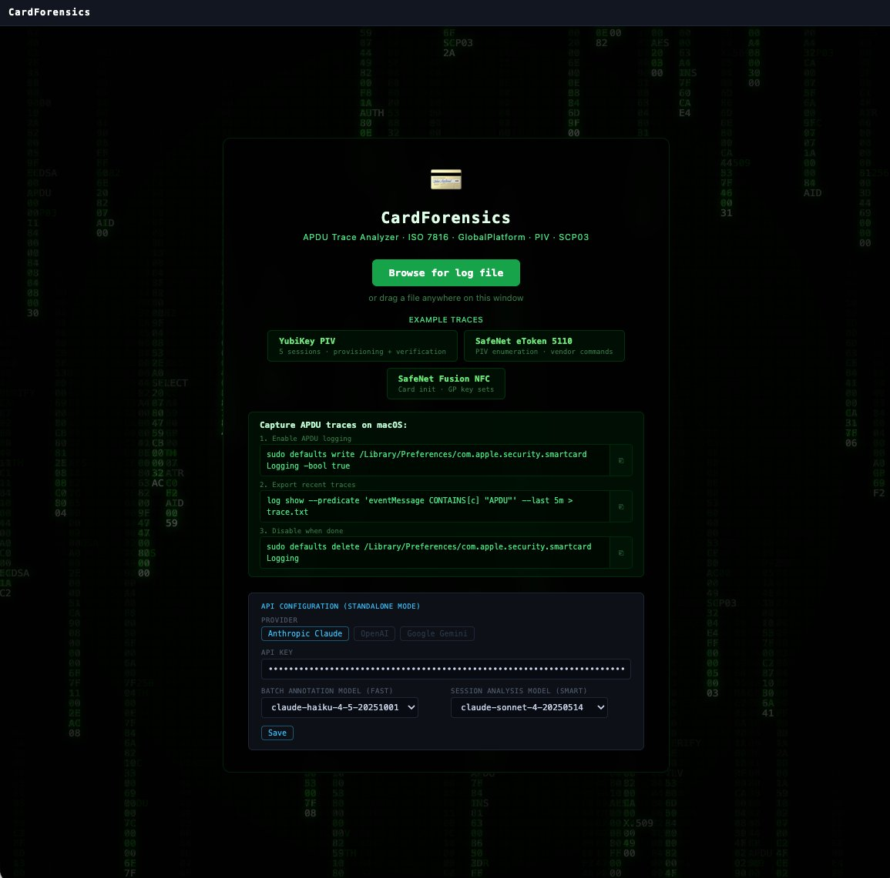
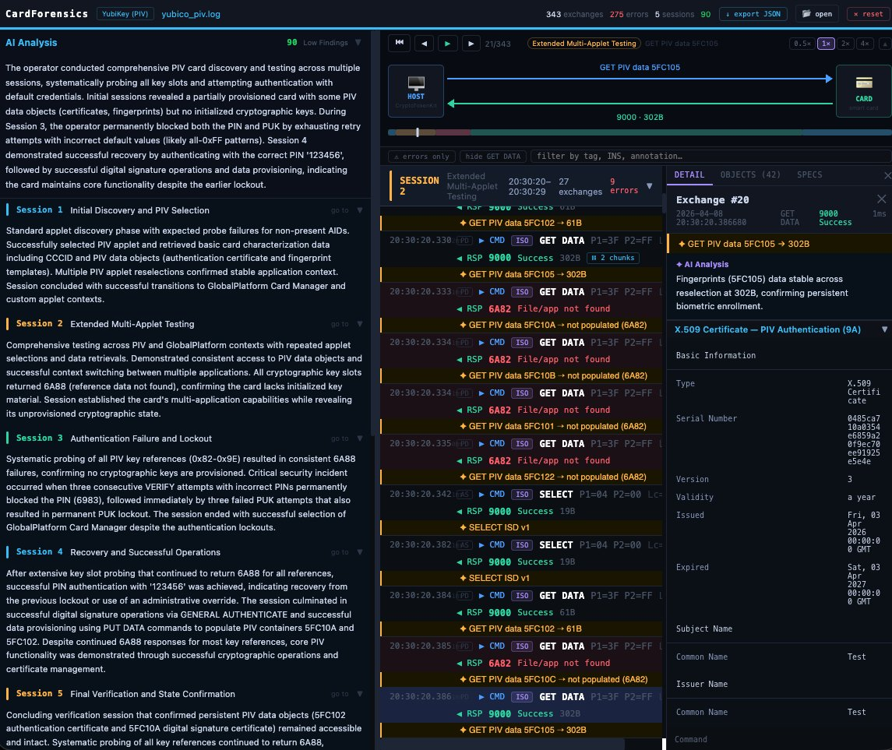

# CardForensics

Client-side smart card APDU trace forensic analyzer. Drop a macOS CryptoTokenKit log file and get:

<p>


</p>

- **Card identification** via ATR database (~5,100 cards including ~200 wildcard patterns), AID database (44 known applications), CLA/tag heuristics, and ATR regex pattern matching
- **ATR structural parsing** — ISO 7816-3 decomposition: convention, protocols, historical bytes, TCK validation
- **Application identification** — EMV (Visa, Mastercard, Amex, JCB, Discover), OpenPGP, FIDO U2F/FIDO2, European eIDs (Belgian, German, Estonian, Spanish, Italian), GlobalPlatform, health cards
- **Protocol reconstruction** — session boundaries, auth state machine, 61xx chaining
- **PIV analysis** — 35 named data objects, 25 key references, 12 algorithm IDs (including ML-DSA-65), certificate slot provisioning checks
- **EMV tag dictionary** — ~50 EMV TLV tags with value interpreters (PAN masking, CVM rules, cryptogram types, transaction counters)
- **Certificate viewer** — X.509 parsing with [Peculiar Ventures certificate viewer](https://github.com/nicolo-ribaudo/nicolo-ribaudo.github.io)
- **Default key detection** — AES-ECB/SCP03 brute-force against known management keys
- **Threat analysis** — credential exposure, nonce replay, timing side-channels, ACL bypass
- **Security scoring** — weighted findings with provisioning-aware confidence gating
- **AI analysis** — optional per-exchange and session-level LLM analysis
- **Forensic export** — deterministic JSON evidence package (schema v2.2) with ATR parse, AID resolution, and database coverage metadata

Everything runs in the browser. No data leaves your machine (unless AI is enabled with your API key).

## Live

[cardforensics.peculiarventures.com](https://peculiarventures.github.io/cardforensics/)

## Development

```bash
npm install
npm run dev
```

## Test

```bash
npm test                 # regression suite (3 traces, 803 exchanges)
npm run test:update      # regenerate snapshots after intentional changes
```

## Build

```bash
npm run build
# Output: dist/index.html (single-file, ~1,370KB)
# Copy to docs/ for GitHub Pages:
cp dist/index.html docs/index.html
```

## License

MIT © [Peculiar Ventures](https://peculiarventures.com)
